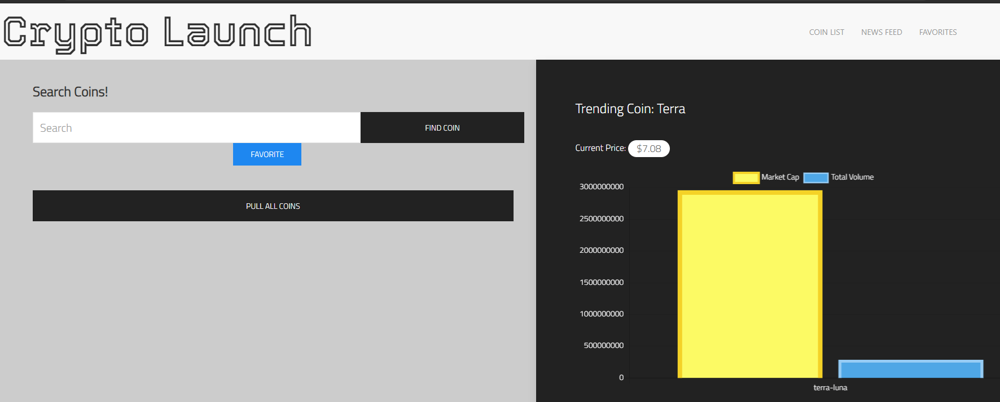
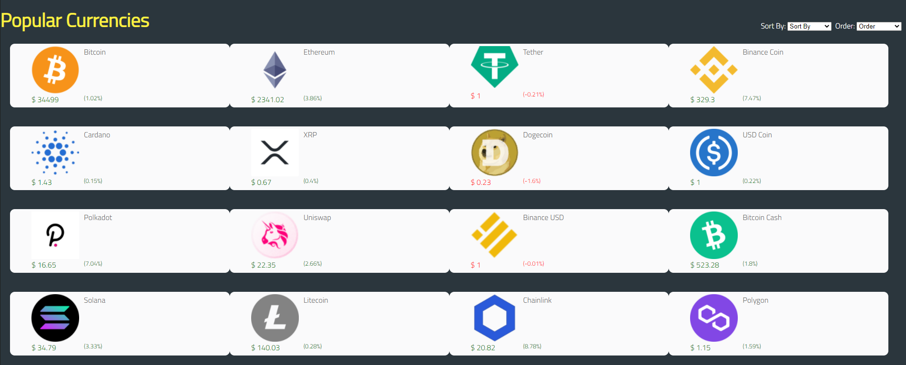
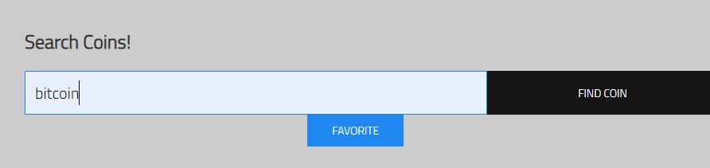
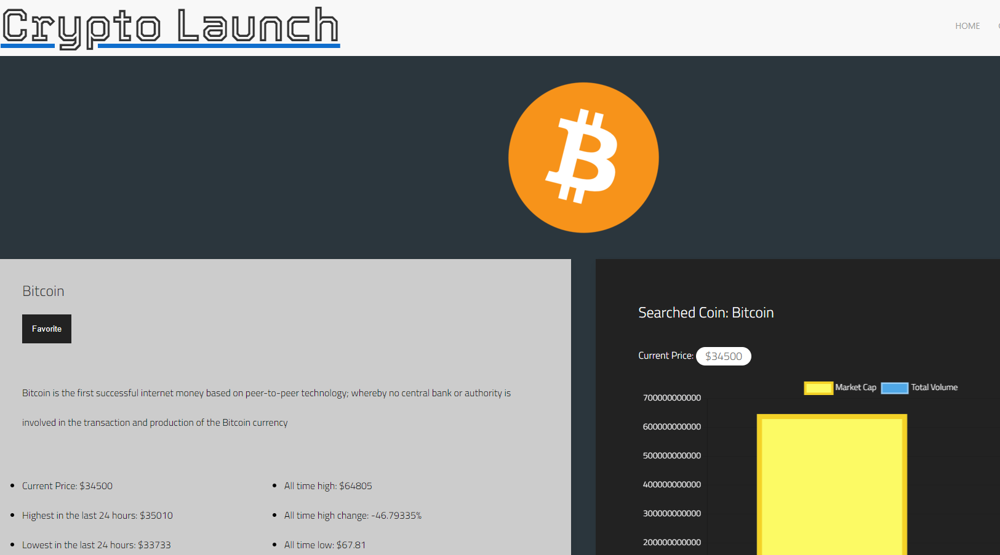

# crypto-launch

## Description
An app for novice crypto investors to quickly find available coins on the market, their current value, and trending news at a glance. The app will provide a more detailed look at the type of cryptocurrency chosen, allowing the user to make investment choices more confidently. 

## Installation
No installation necessary. An internet browser is required. 

## Usage
1. Point your browswer to <a href="https://m-car.github.io/crypto-launchpad/index.html">CryptoLaunch</a>.
2. View a trending coin's news and market stats on the homepage.

3. Click Pull All Coins button to display the top ranked coins. 

4. Search for a specific coin. 

5. View a specific coin's focus page.
 

## Credits
This was a group collaboration with <a href="https://github.com/vivicowan">Vivianna Cowan</a>, <a href="https://github.com/maxd66">Maxwell Dunn</a>, and <a href="https://github.com/m-car">Marko Caric</a>. 

<a href="https://www.coingecko.com/en/api">CoinGecko</a>'s API was used to pull trending coins and stats. 
<a href="https://developer.nytimes.com/apis">New York Times</a> article search API was used to fetch news articles on coins.

Special Thanks to our instructor <a href="https://github.com/median-man">John Desrosier</a> and our UCSD Extension classmates.